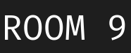

<!--
*** Thanks for checking out the Best-README-Template. If you have a suggestion
*** that would make this better, please fork the repo and create a pull request
*** or simply open an issue with the tag "enhancement".
*** Thanks again! Now go create something AMAZING! :D
-->


<!-- PROJECT SHIELDS -->
<!--
*** I'm using markdown "reference style" links for readability.
*** Reference links are enclosed in brackets [ ] instead of parentheses ( ).
*** See the bottom of this document for the declaration of the reference variables
*** for contributors-url, forks-url, etc. This is an optional, concise syntax you may use.
*** https://www.markdownguide.org/basic-syntax/#reference-style-links
-->
<!-- [![Contributors][contributors-shield]][contributors-url]
[![Forks][forks-shield]][forks-url]
[![Stargazers][stars-shield]][stars-url]
[![Issues][issues-shield]][issues-url]
[![MIT License][license-shield]][license-url]
[![LinkedIn][linkedin-shield]][linkedin-url] -->


<!-- PROJECT LOGO -->
<br />
<p align="center">
  <a href="https://github.com/othneildrew/Best-README-Template">
    
  </a>

  <h3 align="center">+++++++++</h3>

  <p align="center">
    Just a good old terminal chat room application
    <br />
    <a href="https://github.com/wasabiegg/room-9/issues">Report Bug</a>
    ·
    <a href="https://github.com/wasabiegg/room-9/issues">Request Feature</a>
  </p>
</p>


<!-- TABLE OF CONTENTS -->
<details open="open">
  <summary>Table of Contents</summary>
  <ol>
    <li>
      <a href="#about-the-project">About The Project</a>
    </li>
    <li>
      <a href="#getting-started">Getting Started</a>
      <ul>
        <li><a href="#prerequisites">Prerequisites</a></li>
        <li><a href="#installation">Installation</a></li>
      </ul>
    </li>
    <li><a href="#usage">Usage</a></li>
    <li><a href="#roadmap">Roadmap</a></li>
    <li><a href="#contributing">Contributing</a></li>
    <li><a href="#license">License</a></li>
    <li><a href="#contact">Contact</a></li>
    <!-- <li><a href="#acknowledgements">Acknowledgements</a></li> -->
  </ol>
</details>


<!-- about the project -->
## about the project

[![Product Demo][project-demo]](https://example.com)


<!-- Here's why:
* Your time should be focused on creating something amazing. A project that solves a problem and helps others
* You shouldn't be doing the same tasks over and over like creating a README from scratch
* You should implement DRY principles to the rest of your life :smile:

Of course, no one template will serve all projects since your needs may be different. So I'll be adding more in the near future. You may also suggest changes by forking this repo and creating a pull request or opening an issue. Thanks to all the people have contributed to expanding this template!

A list of commonly used resources that I find helpful are listed in the acknowledgements. -->

<!-- ### Built With

This section should list any major frameworks that you built your project using. Leave any add-ons/plugins for the acknowledgements section. Here are a few examples.
* [Bootstrap](https://getbootstrap.com)
* [JQuery](https://jquery.com)
* [Laravel](https://laravel.com) -->


<!-- GETTING STARTED -->
## Getting Started


### Prerequisites

> Tested in linux, window might work, but you need to pip install windows-curses

* \>= python3.6 

### Installation

1. Clone the repo
   ```sh
   git clone https://github.com/wasabiegg/room-9.git
   ```
2. Install dependency
   ```sh
   cd room-9/
   pip install -r requirements.txt
   ```


<!-- USAGE EXAMPLES -->
## Usage

1. on server
  ```sh
  cd room-9/
  python server/server.py 127.0.0.1:9090
  ```
2. on client
  ```sh
  cd room-9/
  python client/client.py 127.0.0.1:9090 -u Jenny 
  ```
3. Have fun!


<!-- ROADMAP -->
## Roadmap
- [ ] RSA encryption
- [ ] Better terminal display
- [ ] Better exception handling
- [ ] Full Unit test

See the [open issues](https://github.com/wasabiegg/room-9/issues) for a list of proposed features (and known issues).


<!-- CONTRIBUTING -->
## Contributing

Contributions are what make the open source community such an amazing place to learn, inspire, and create. Any contributions you make are **greatly appreciated**.

1. Fork the Project
2. Create your Feature Branch (`git checkout -b feature/AmazingFeature`)
3. Commit your Changes (`git commit -m 'Add some AmazingFeature'`)
4. Push to the Branch (`git push origin feature/AmazingFeature`)
5. Open a Pull Request


<!-- LICENSE -->
## License

Distributed under the MIT License. See `LICENSE` for more information.


<!-- CONTACT -->
## Contact

Project Link: [https://github.com/wasabiegg/room-9](https://github.com/wasabiegg/room-9)


<!-- ACKNOWLEDGEMENTS -->
<!-- ## Acknowledgements
* [GitHub Emoji Cheat Sheet](https://www.webpagefx.com/tools/emoji-cheat-sheet)
* [Img Shields](https://shields.io)
* [Choose an Open Source License](https://choosealicense.com)
* [GitHub Pages](https://pages.github.com)
* [Animate.css](https://daneden.github.io/animate.css)
* [Loaders.css](https://connoratherton.com/loaders)
* [Slick Carousel](https://kenwheeler.github.io/slick)
* [Smooth Scroll](https://github.com/cferdinandi/smooth-scroll)
* [Sticky Kit](http://leafo.net/sticky-kit)
* [JVectorMap](http://jvectormap.com)
* [Font Awesome](https://fontawesome.com) -->


<!-- MARKDOWN LINKS & IMAGES -->
<!-- https://www.markdownguide.org/basic-syntax/#reference-style-links -->
<!-- [contributors-url]: https://github.com/othneildrew/Best-README-Template/graphs/contributors
[forks-url]: https://github.com/othneildrew/Best-README-Template/network/members
[stars-url]: https://github.com/othneildrew/Best-README-Template/stargazers
[issues-url]: https://github.com/othneildrew/Best-README-Template/issues
[license-url]: https://github.com/othneildrew/Best-README-Template/blob/master/LICENSE.txt -->
[project-demo]: images/demo.gif
